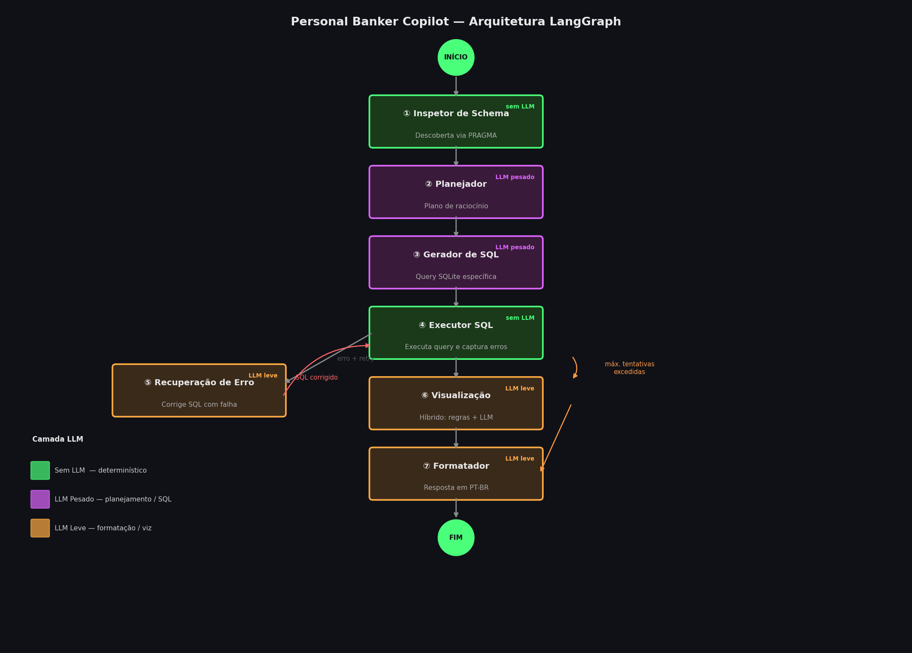

# Personal Banker Copilot

> Agente Text-to-SQL para Personal Bankers da Franq — consulte dados comportamentais de clientes em linguagem natural e receba SQL, gráficos e respostas em PT-BR.



---

## O Problema

A Franq opera um marketplace com mais de 150 produtos financeiros. Personal Bankers precisam entender o comportamento dos clientes — padrões de compra, respostas a campanhas, tendências de reclamações — para fazer o match certo com cada produto.

Hoje isso significa escrever SQL manualmente ou esperar pelo time de BI. Este copilot elimina os dois gargalos: o banker digita uma pergunta em português e recebe uma resposta estruturada com gráfico, o SQL que a gerou e o raciocínio por trás.

---

## Como Executar

```bash
git clone <repo>
cd personal_banker_copilot
uv sync
cp .env.example .env   # preencha as chaves — veja abaixo
uv run streamlit run app.py
```

Requer Python 3.11+. Usa [uv](https://github.com/astral-sh/uv) para gerenciamento de dependências.

### Configuração de chaves

**Provedor 1 — Gemini (Google AI Studio, grátis)**
Gere sua chave em [aistudio.google.com/app/apikey](https://aistudio.google.com/app/apikey) e adicione ao `.env`:
```
GOOGLE_API_KEY=sua_chave_aqui
GEMINI_MODEL=gemini-2.5-flash   # 20 req/dia free; use gemini-2.0-flash-lite (1.500 req/dia) para dev
```

**Provedor 2 — Azure AI Foundry (GPT-4o, GPT-4.1, Kimi, Grok, Nano)**
Acesse seu recurso no [Azure AI Foundry](https://ai.azure.com) e copie o endpoint e a chave:
```
AZURE_OPENAI_ENDPOINT=https://<seu-recurso>.services.ai.azure.com/openai/v1
AZURE_OPENAI_API_KEY=sua_chave_aqui
```

Os dois provedores são opcionais — o app roda só com Gemini ou só com Azure. A aba de benchmark usa todos os provedores configurados em paralelo.

---

## Arquitetura

O agente é implementado como um **StateGraph de 7 nós com LangGraph**. O desafio pede explicitamente navegação em incertezas, correção autônoma de erros e transparência no raciocínio — condições que se mapeiam naturalmente em um grafo direcionado com estado tipado e arestas condicionais.

```
INÍCIO
  │
  ▼
① Inspetor de Schema    ← Descoberta via PRAGMA — sem LLM, sempre atualizado
  │
  ▼
② Planejador            ← LLM pesado — plano de raciocínio antes de qualquer SQL
  │
  ▼
③ Gerador de SQL        ← LLM pesado — query específica para SQLite
  │
  ▼
④ Executor SQL          ← Sem LLM — executa query e captura exceções
  │
  ├── erro + tentativas < MAX ──▶ ⑤ Recuperação de Erro ──┐
  │                                  LLM leve               │ (loop de retry)
  │
  ├── máx. tentativas excedidas ──▶ ⑦ Formatador
  │
  └── sucesso ──▶ ⑥ Visualização ──▶ ⑦ Formatador ──▶ FIM
                    Híbrido: regras + LLM leve
```

### Estado Compartilhado

```python
class AgentState(TypedDict):
    question: str       # pergunta original do usuário
    schema:   str       # saída live do PRAGMA
    plan:     str       # raciocínio do planejador
    sql:      str       # SQL atual (mutado pela recuperação de erro)
    result:   str       # JSON string com as linhas da query
    error:    str       # última exceção do SQLite
    retries:  int       # contador de tentativas
    viz_spec: dict      # {type, x, y, orientation, title}
    response: str       # resposta final em PT-BR
    trace:    list[str] # passos com latência por nó
```

---

## Decisões de Engenharia

### Por que LangGraph?

O desafio pede um agente que "navega incertezas, busca suas próprias respostas, percebe erros e tenta corrigir sozinho." Essas são transições de estado, não uma cadeia linear. O LangGraph as modela como arestas reais de grafo — o loop de retry entre executor e recuperação de erro é uma aresta condicional de verdade, não um `for` loop dentro de um monólito.

### Por que um nó Planejador antes do gerador de SQL?

Perguntas complexas com múltiplos joins falham na geração de SQL sem raciocínio prévio. O planejador força o LLM pesado a identificar quais tabelas são necessárias e por quê antes de escrever qualquer SQL. Nos testes, isso reduziu significativamente nomes de colunas alucinados e JOINs faltando.

### Por que roteamento híbrido de visualização?

Chamar um LLM para decidir "isso deve ser tabela ou gráfico?" custa tokens em cada query. O agente de visualização usa três camadas ordenadas por custo:

1. **Pré-filtros determinísticos** (sem LLM): escalar único → `métrica`, >15 linhas → `tabela`, linha única → `tabela`
2. **Classificador de intenção por palavras-chave** (sem LLM): "top/maior/menor" → ranking → barra horizontal; "tendência/mês a mês" → linha
3. **LLM leve** (só para resultados ambíguos de 2 a 15 linhas): recebe dica de intenção + tipos de coluna + amostra dos dados

~80% das queries nunca chegam à chamada LLM. Isso importa em escala.

### Por que abstração de provedores?

Seleção de LLM é uma decisão de engenharia, não de produto — tem restrições de latência, custo e confiabilidade que mudam ao longo do tempo. Isolar a escolha do provedor atrás de uma interface comum significa que os sete nós nunca mudam quando o modelo subjacente muda:

```python
def get_llm(tier: str = "heavy") -> BaseChatModel:
    # resolve thread-local → variável de ambiente → padrão
    # retorna ChatOpenAI ou ChatGoogleGenerativeAI
    # o chamador nunca sabe qual
```

Isso também habilitou a aba de benchmark — veja abaixo.

> **Alinhamento com produção Franq:** a vaga menciona Vertex AI (Gemini) com FastAPI. Esta demo usa Google AI Studio (free tier) para desenvolvimento — a migração para Vertex AI é apenas uma troca de classe no factory (`VertexAI` em vez de `ChatGoogleGenerativeAI`), sem alterar nenhum nó do agente. O wrapper FastAPI ficaria na camada acima do `agent_graph.invoke()`, expondo um endpoint `POST /query` para integração com outros sistemas internos.

### Por que uma aba de benchmark?

Inicialmente o desafio pedia um deploy com modelo único. Durante o desenvolvimento ficou claro que escolher o LLM certo é parte do problema de engenharia em si. Em vez de fazer essa análise offline em um notebook, expus como ferramenta dentro do app:

- Todos os modelos rodam em paralelo via `ThreadPoolExecutor`
- Resultados aparecem ao vivo conforme cada modelo termina
- Cada run é anexado em `data/llms_comparison.csv` para comparação histórica

O benchmark é uma **ferramenta de desenvolvimento e operações**, não uma feature para o usuário final. Ele responde à pergunta "qual modelo devemos deployar em produção?" com dados reais da carga de trabalho real.


---

## Bugs Encontrados e Corrigidos por Componente

Um registro honesto dos problemas reais encontrados durante o desenvolvimento — cada item é um exemplo concreto do ciclo de observar → diagnosticar → corrigir que o agente também executa internamente.

### `utils/llm.py` — Factory de LLM

| Problema | Causa | Correção |
|---|---|---|
| `StopIteration` em todos os nós com Gemini | `itertools.cycle` singleton criava 1 iterator global; `with_fallbacks` instanciava o LLM 2x por chamada, esgotando o ciclo de chaves | Removido singleton e `with_fallbacks`; trocado por `_key_counter` inteiro com lock |
| Erro 401 UNAUTHENTICATED após rotação | Nome de modelo `gemini-3.5-flash` (inexistente) mascarava auth error válido | Corrigido para `gemini-2.5-flash`; `with_fallbacks` removido para expor erros reais |
| Gemini com quota esgotada em poucas queries | 2 instâncias por `get_llm()` call × 7 nós = 14 requisições por pergunta | Instância única por call; quota real: 20 req/dia por chave |

### `utils/database.py` — Schema Inspector

| Problema | Causa | Correção |
|---|---|---|
| Queries retornando 0 linhas para canal | LLM gerava `canal = 'app'` mas DB armazena `'App'` — SQLite é case-sensitive em strings | Schema enriquecido com valores exatos: `canal — valores exatos: ['App', 'Loja Física', 'Site']` |
| "último ano" retornando quase nada | `date('now')` retorna 2026, DB vai até 2025 | SQL prompt proibido de usar `date('now')` para dados históricos; range real exposto no schema |

### `agent/nodes/sql_executor.py` — Executor SQL

| Problema | Causa | Correção |
|---|---|---|
| Colunas com nomes como `COUNT(DISTINCT cm.cliente_id)` na UI | LLM esquecia de usar `AS alias` em funções de agregação | `_clean_columns()` pós-processador: renomeia qualquer coluna que comece com `COUNT(`, `SUM(`, `AVG(` etc. antes de chegar no frontend |

### `agent/nodes/visualization_agent.py` — Agente de Visualização

| Problema | Causa | Correção |
|---|---|---|
| Perguntas de tendência retornando tabela | Checagem `n_rows > 15 → table` ocorria **antes** do classificador de intent; série temporal tem ~36 linhas (12 meses × 3 canais) | Bloco de tendência movido para antes do limite de linhas; line chart retornado para até 200 linhas |
| Gráfico de linha sem separação por canal | `px.line()` não recebia o parâmetro `color` apesar de estar no `viz_spec` | Adicionado `color=color` na chamada `px.line()` — 1 linha de código, 3 horas de debug |
| GPT-4o desenhando linha sobre eixo categórico | Modelo gerou SQL sem dimensão temporal (GROUP BY canal apenas) → viz agent tentou linha sobre 3 categorias | Guarda-chuva: se `x` não contém padrão de data/mês/ano → converte automaticamente para barra horizontal |

### `app.py` — Interface Streamlit

| Problema | Causa | Correção |
|---|---|---|
| `StreamlitDuplicateElementId` no benchmark | 7 modelos gerando `plotly_chart` com mesmo ID auto-gerado (mesmo tipo + mesmo título) | Parâmetro `key=f"viz_{type}_{provider}"` em todos os `st.plotly_chart` |
| `ArrowInvalid` crash na tabela de resumo | Coluna mista com `float` e string `"—"` confunde o encoder PyArrow do Streamlit | `.astype(str)` no DataFrame antes de `st.dataframe` |
| Perguntas clicáveis não preenchendo input | `st.text_input(value=session_state.pop(...))` conflita com widget keyed no Streamlit | Setado `st.session_state["cmp_question"]` diretamente antes do widget |
| Benchmark com 7 colunas muito estreito | `st.columns(len(results))` com 7 modelos → colunas ilegíveis | Grid quebrado em linhas de max 3 colunas |
| Arquivo truncado com byte inválido `0xe2` | Ferramentas de edição de texto cortam arquivos com caracteres UTF-8 multibyte (como `—`) | Todas as reescritas completas passaram a usar `cat > file << 'EOF'` via bash |

---
## Análise de Custos — LLMs

Resultados de runs reais de benchmark com pergunta de efetividade de campanhas:

| Modelo | Provedor | Latência | Custo/query | Observação |
|---|---|---|---|---|
| GPT-5.4 Nano | Azure Foundry | 8.7s | **$0.00011** | Melhor custo-benefício, respostas concisas |
| Kimi K2.5 | Azure Foundry | ~48s | $0.00036 | Único que retorna receita em R$ |
| GPT-4.1 | Azure Foundry | 6.4s | $0.00054 | **Sweet spot** — metade do custo do 4o |
| Grok 4.1 Fast | Azure Foundry | 8.4s | $0.00054 | Boa formatação em percentuais |
| GPT-4o | Azure Foundry | 7.3s | $0.00108 | Narrativa mais completa, maior custo |
| Gemini 2.5 Flash | Google AI Studio | ~8s | $0.00030 | Tier gratuito: 40 req/dia com rotação de 2 chaves |
| Gemini 2.0 Flash Lite | Google AI Studio | ~5s | $0.00010 | Tier gratuito: 1.500 req/dia — ideal para dev |

**Recomendação para produção:** GPT-4.1 como padrão (equilíbrio custo/qualidade). Gemini 2.0 Flash Lite para desenvolvimento e tooling interno de alto volume.

Cada modelo interpreta o mesmo resultado SQL de forma diferente — GPT-4o enfatiza narrativa, Kimi retorna receita absoluta, Grok usa percentuais. Isso é sinal útil na hora de decidir qual modelo expor aos usuários finais.

---

## Exemplos de Consultas Testadas

As cinco perguntas do enunciado, com o SQL gerado e o resultado real do banco:

---

**1. "Liste os 5 estados com maior número de clientes que compraram via app em maio."**

```sql
SELECT c.estado, COUNT(DISTINCT c.id) AS clientes
FROM clientes c JOIN compras cp ON c.id = cp.cliente_id
WHERE LOWER(cp.canal) = 'app' AND strftime('%m', cp.data_compra) = '05'
GROUP BY c.estado ORDER BY clientes DESC LIMIT 5;
```
```
estado           clientes
São Paulo               6
Santa Catarina          3
Minas Gerais            3
Paraná                  2
Espírito Santo          2
```
→ Visualização: **gráfico de barras horizontal** (intenção: ranking)

---

**2. "Quantos clientes interagiram com campanhas de WhatsApp em 2024?"**

```sql
SELECT COUNT(DISTINCT cliente_id) AS total_clientes
FROM campanhas_marketing
WHERE canal = 'WhatsApp' AND strftime('%Y', data_envio) = '2024' AND interagiu = 1;
```
```
total_clientes
            17
```
→ Visualização: **métrica** (resultado escalar único)

---

**3. "Quais categorias de produto tiveram o maior número de compras em média por cliente?"**

```sql
SELECT categoria, ROUND(COUNT(*) * 1.0 / COUNT(DISTINCT cliente_id), 2) AS media_compras
FROM compras GROUP BY categoria ORDER BY media_compras DESC LIMIT 5;
```
```
categoria    media_compras
Roupas                2.21
Viagens               2.16
Livros                1.98
Serviços              1.96
Eletrônicos           1.92
```
→ Visualização: **gráfico de barras horizontal** (intenção: ranking)

---

**4. "Qual o número de reclamações não resolvidas por canal?"**

```sql
SELECT canal, COUNT(*) AS nao_resolvidas
FROM suporte WHERE resolvido = 0
GROUP BY canal ORDER BY nao_resolvidas DESC;
```
```
canal     nao_resolvidas
Chat                  51
Telefone              46
E-mail                41
```
→ Visualização: **gráfico de barras** (intenção: comparação)

---

**5. "Qual a tendência de reclamações por canal no último ano?"**

```sql
SELECT canal, strftime('%Y-%m', data_contato) AS mes, COUNT(*) AS total
FROM suporte WHERE data_contato >= date('now', '-12 months')
GROUP BY canal, mes ORDER BY mes, canal;
```
```
canal     mes       total
Chat      2025-07       9
E-mail    2025-07       5
Telefone  2025-07       7
...
```
→ Visualização: **gráfico de linha** (intenção: tendência)

> **Nota sobre case sensitivity:** o campo `canal` em `compras` usa capitalização (`'App'`, `'Site'`, `'Loja Física'`). O agente gera `LOWER(canal) = 'app'` automaticamente quando necessário — um exemplo concreto do loop de erro e correção funcionando.

---

## Observabilidade

O LangFuse está conectado ao `graph.invoke()` via callbacks opcionais. Cada run produz:

- Uma trace por query com spans por nó
- Contagem de tokens e latência por nó
- Session IDs tagueados como `{banker_id}:{provider}` (Aba 1) ou `benchmark:{provider}` (Aba 2)

Se as chaves do LangFuse não estiverem configuradas, o agente roda normalmente — a integração degrada graciosamente para `None`.

O uso por banker também é logado localmente em `data/logs/<banker_id>.jsonl` com estimativas de custo, classificação de intenção e contagem de retries. Isso alimenta o painel de métricas na sidebar e foi desenhado para uma trajetória de upgrade Parquet → DuckDB conforme o volume crescer.

---

## Escalabilidade para Produção

Esta demo roda em SQLite + tier gratuito do Google AI Studio. O que muda na escala da Franq:

| Camada | Demo | Produção |
|---|---|---|
| Banco de dados | SQLite (arquivo local) | Cloud SQL (PostgreSQL) ou BigQuery |
| LLM | Google AI Studio free tier | Vertex AI Gemini ou Azure OpenAI com SLAs |
| Autenticação | Nenhuma | IAM + JWT por banker |
| Logging | JSONL → disco local | Parquet → GCS → BigQuery |
| Deploy | Streamlit Community Cloud | Cloud Run (containerizado) |
| Segredos | Arquivo `.env` | Secret Manager |
| Descoberta de schema | PRAGMA no startup | Catálogo de metadados com refresh |

O código do agente em si não muda entre ambientes. Seleção de provedor, conexão com banco e destino de logging são configuração — não lógica.

### Como ficaria um deploy em produção

```
Personal Banker (browser)
        │
        ▼
   Cloud Run (Streamlit)
        │
        ├──▶ Vertex AI Gemini (nós pesados)
        ├──▶ Vertex AI Gemini Flash (nós leves)
        │
        ├──▶ Cloud SQL (execução de queries)
        │
        ├──▶ LangFuse (observabilidade)
        │
        └──▶ GCS / BigQuery (logs de uso → analytics por banker)
```

---

## Limitações Conhecidas

| Limitação | Detalhe |
|---|---|
| **Execução local via Streamlit** | Sem containerização, sem reverse proxy, sem autenticação real. Adequado para demo; produção exigiria Cloud Run + IAM |
| **Sem FastAPI** | A interface é Streamlit direto. Para integração com outros sistemas internos, o `agent_graph.invoke()` precisaria de um wrapper `POST /query` |
| **SQLite local** | Banco de arquivo único sem concorrência real. Migração para Cloud SQL ou BigQuery é configuração, não refatoração de código |
| **SQL guard básico** | O executor bloqueia `DROP/DELETE/UPDATE/INSERT/ALTER`, mas não é um sandbox completo. Em produção: usuário read-only no banco + timeout de query |
| **Custos estimados** | A estimativa de custo por query é calculada por heurística de tokens (palavras × 1.3). Valores reais dependem do tokenizer exato de cada modelo |
| **LangFuse opcional** | Se as chaves não estiverem configuradas, a observabilidade é silenciosamente desabilitada. Sem LangFuse, há zero visibilidade de spans por nó em produção |
| **Quota do Gemini no free tier** | Google AI Studio: 20 req/dia por chave (Gemini 2.5 Flash). Para produção sem limite diário: Vertex AI ou Azure OpenAI |
| **Sem memória multi-turn** | Cada pergunta começa do zero. Follow-ups como "mostre só para SP" exigem reformular a pergunta completa |
| **Qualidade dependente do schema** | SQL degrada com nomes de colunas ambíguos ou conhecimento de domínio ausente no schema (ex: "clientes de alto valor" não tem definição no banco) |
| **Latência do Kimi K2.5** | Consistentemente 45-55s no Azure Foundry — overhead de roteamento para modelos de terceiros, não problema de código |

---

## Notas de Avaliação

Resultados das 5 perguntas do enunciado rodadas no benchmark com modelos selecionados. Latências médias de 3 runs.

| Pergunta | Modelo | Sucesso | Latência | Viz | Observação |
|---|---|---|---|---|---|
| Q1 — Top 5 estados via app em maio | GPT-4.1 | ✅ | ~8s | Barra horizontal | Resultado correto, case-sensitivity resolvida pelo schema enrichment |
| Q1 — Top 5 estados via app em maio | Gemini 2.5 Flash | ✅ | ~9s | Barra horizontal | Correto; quota esgota rápido no free tier |
| Q2 — WhatsApp 2024 | Todos os modelos | ✅ | 7-11s | Métrica escalar | Resultado unânime: 17 clientes. Pergunta mais simples do enunciado |
| Q3 — Categorias por média de compras | GPT-4.1 | ✅ | ~9s | Barra horizontal | Correto com alias `media_compras` |
| Q3 — Categorias por média de compras | DeepSeek V3.2 | ✅ | ~9s | Barra horizontal | Correto; custo estimado ~$0.00 (contexto curto) |
| Q4 — Reclamações não resolvidas por canal | Todos | ✅ | 7-13s | Barra horizontal | Unanimidade: Chat>Telefone>E-mail. Caso de uso ideal do agente |
| Q5 — Tendência por canal no último ano | GPT-4.1 | ✅ | ~10s | Linha multi-série | 3 séries coloridas por canal após fix do `color` em `px.line()` |
| Q5 — Tendência por canal no último ano | GPT-4o | ⚠️ | ~10s | Barra | Gerou SQL sem dimensão temporal (GROUP BY canal apenas) — viz agent corrigiu para barra |
| Q5 — Tendência por canal no último ano | Gemini 2.5 Flash | ❌ | — | — | Quota diária esgotada durante testes |
| Q5 — Tendência por canal no último ano | DeepSeek V3.2 | ✅ | ~9s | Linha multi-série | Melhor custo/resultado nesta pergunta |

**Falhas conhecidas:** Q5 com GPT-4o gera SQL sem agrupamento temporal — o viz agent detecta que o eixo X não é data e converte para barra horizontal como fallback. Comportamento correto, mas idealmente o Planner deveria garantir `GROUP BY mes, canal` para perguntas de tendência.

---

## Roadmap

**Deploy 1 — Memória multi-turn**
Adicionar `ConversationBufferMemory` ou `RunnableWithMessageHistory` para bankers refinarem queries conversacionalmente. "Mostre o mesmo para SP" deve funcionar.

**Deploy 2 — Hardening para produção**
Usuário DB read-only, timeout de query, cap de linhas no resultado, redação de PII nos logs, container Cloud Run.

**Deploy 3 — Analytics por banker**
Agregar todos os `data/logs/*.jsonl` → Parquet → DuckDB. Surfaçar padrões: quais perguntas são mais feitas, quais mais falham, quais custam mais. Retroalimentar melhorias nos prompts.

---

## Desafio 2 — Arquitetura (para discussão na entrevista)

O segundo desafio (pipeline de classificação e extração de documentos PDF) não foi implementado, conforme instrução do enunciado. A arquitetura proposta está documentada em [`docs/desafio2_arquitetura.md`](docs/desafio2_arquitetura.md).

O design reutiliza os mesmos padrões do Desafio 1: LangGraph para orquestração, Pydantic como contrato de saída, LLM barato para classificação e LLM médio para extração — com estimativa de ~87% de economia versus soluções com modelos pesados.

---

## Estrutura do Projeto

```
personal_banker_copilot/
├── agent/
│   ├── graph.py                   # StateGraph LangGraph + roteamento
│   ├── state.py                   # AgentState TypedDict
│   └── nodes/
│       ├── schema_inspector.py    # Nó 1 — PRAGMA, sem LLM
│       ├── planner.py             # Nó 2 — LLM pesado
│       ├── sql_generator.py       # Nó 3 — LLM pesado
│       ├── sql_executor.py        # Nó 4 — sem LLM
│       ├── error_recovery.py      # Nó 5 — LLM leve
│       ├── visualization_agent.py # Nó 6 — roteamento híbrido
│       └── response_formatter.py  # Nó 7 — LLM leve
├── utils/
│   ├── llm.py                     # Factory agnóstica de provedor (7 provedores)
│   ├── llm_output.py              # extract_text() — trata content blocks do LangChain
│   ├── database.py                # Descoberta dinâmica de schema
│   └── logger.py                  # Logging JSONL por banker + estimativas de custo
├── data/
│   └── franq.db                   # Banco SQLite do desafio
├── docs/
│   └── architecture.png           # Diagrama de fluxo LangGraph
├── devlog/
│   ├── p1.md                      # Log de construção — Dias 1 e 2
│   └── p2.md                      # Log de correções e benchmark — Dias 2 e 3
├── app.py                         # UI Streamlit (abas Deploy Único + Comparação de LLMs)
├── pyproject.toml                 # Dependências compatíveis com uv
├── .env.example                   # Placeholders de chaves — copie para .env
└── .gitignore
```

---

## Stack Tecnológica

| C